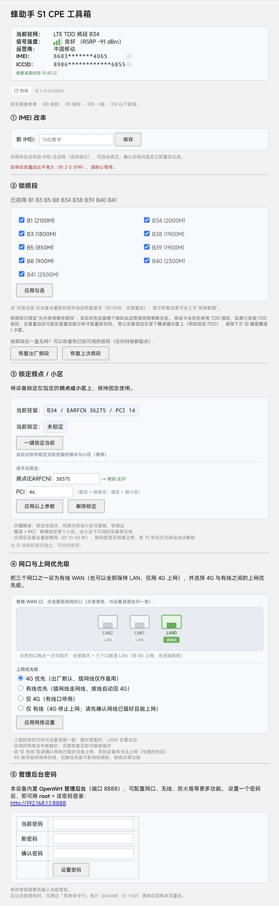
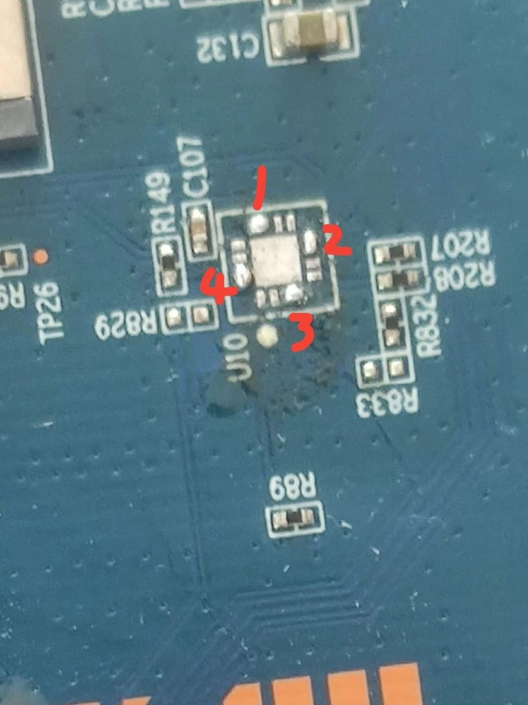

# 蜂助手 S1 CPE 去云控改造

> 把「蜂助手 S1」（MIBOX-668M2）的云端控制彻底拿掉，同时保留并增强本地功能。
> 一个压缩包替换 + 重启，即可获得：**去云控 + IMEI 改串 + 锁频段 + 锁频点/小区 + 设备数据面板**。

**语言 / Language：** 简体中文 | [English](README_EN.md)

**适用范围与关键词**（方便检索）：
`ASR 平台`（ASR1802 / ASR1803 / 翱捷科技）、`Quectel EC200T` / `EC200N` / `EC200A`、
`AT*BAND`（锁频段 / band lock）、`AT*CELL`（锁频点 / 锁小区 / frequency lock / cell lock）、
`EARFCN`、`PCI`、`AT+QENG="servingcell"`、`MT7628` 4G CPE、`蜂助手 S1` / `MIBOX-668M2`。

> 📄 **只用同款模组、想找 AT 命令的人**：可直接看这两份独立文档——
> **[ASR 平台 AT 命令：锁频段 / 锁频点 / 锁小区](ASR平台AT命令-锁频段锁频点锁小区.md)**（中文）
> ｜ [English](ASR-AT-Commands-Band-Cell-Lock.md)

> ⚠️ **使用前请务必阅读 [免责声明](#免责声明)。本项目涉及修改 IMEI，在多数国家和地区受法律管制，仅限对你本人合法拥有的设备使用。**

> 💚 **本项目完全免费、开源，没有任何收费内容。** 我们不卖设备、不卖服务、不提供付费版、不接任何打赏或推广。如果你是在**花钱**买到这份固件或这套教程，**你被坑了**——请立即向卖家要求退款，并欢迎到仓库 Issue 举报。详见 [关于免费](#关于免费)。

---

**工具箱界面一览**（数据面板 / ① IMEI 改串 / ② 锁频段 / ③ 锁定频点·小区 / ④ 管理后台密码）：



## 这是什么设备

| 项目 | 说明 |
|---|---|
| 型号 | 蜂助手 S1（MIBOX-668M2） |
| 主控 | MT7628DAN |
| 系统 | OpenWrt Barrier Breaker 14.07 / 内核 3.10.14 |
| 存储 | 8MB flash / 64MB RAM |
| 4G 模组 | Quectel EC200T（CAT4，主模组） |
| 云卡模组 | Quectel EC200N（CAT1，内置贴片卡） |

这类设备出厂时内置了**迪讯飞（Dinstar）云控系统**：通过 CAT1 云卡通道从厂商平台下发虚拟卡（由 CAT4 承载数据上行），并上传日志、接受云端 OTA 和限速指令。本项目的目标是把这套云控拆掉，让设备变成一个**完全属于你自己的 4G 路由器**。

---

## 硬件说明（拿到手先看这里，涉及 SIM 卡改造）

这个设备出厂有两种硬件版本，并且**两种版本都有一个共同的缺件**，想用实体 SIM 卡必须先处理：

| 出厂版本 | 需要做的改造 |
|---|---|
| **带卡槽版** | 主板已焊好 SIM 卡槽，但 **U10 元件位缺件**——需要拆机，把 U10 焊盘按下图短接/焊接 |
| **不带卡槽版** | 主板**没有 SIM 卡槽**——需要自行补焊一个 SIM 卡槽，**并同样处理 U10** |

**U10 焊接示意**（主板上丝印 `U10` 的位置，旁边有 C107、R149、R829、R832、R833 等丝印；图中红色 1/2/3/4 标注了对应的引脚位）：



- 没有处理 U10 的设备，**插上实体 SIM 卡无法被模组识别**（这也是很多用户"插卡无服务"的原因）
- **焊接有风险**：短路会导致整个 USB 总线消失（模组和 Hub 同时失联）。请确认烙铁接地、焊点无连锡后再上电
- 设备有 GL850G USB Hub 芯片，原厂只引出一组 USB，另一组可自行焊接（随身 WiFi 等）
- 随身 WiFi 供电不稳可能导致设备重启，建议加电容或使用独立供电
- 改装的 LAN→WAN 口需在 OpenWrt 中配置交换机 VLAN

---

## 快速开始

> **页面名称对照**（全文通用）：**设备管理页面** = 浏览器打开 `http://192.168.1.1`（原厂自带的后台，账号密码都是 `admin`）；**LuCI 后台** = `http://192.168.1.1:8888`（完整 OpenWrt 界面）；**工具箱** = `http://192.168.1.1:8088`（本项目新增）。

### 前提条件

- **已完成硬件改造**（SIM 卡槽与 U10 焊接，见上一节「硬件说明」）——否则插卡无服务，本项目无从谈起
- 设备已能正常开机（原厂系统）
- 电脑与设备在同一局域网（默认设备地址 `192.168.1.1`）
- 说明：**推荐方式（设备管理页面上传）不需要设备能上网**

### 下载哪个包？

**仓库首页只有最新版的两个包**，按你的刷机方式选一个：

| 文件 | 大小 | 适用方式 |
|---|---|---|
| **`package-full.tar.gz`** | 2.4 MB | **设备管理页面「软件升级」上传（推荐方式）** |
| `package-slim.tar.gz` | 1.2 MB | 系统命令行 / telnet（方式 A/C 用，体积小） |

> 两个包功能**完全一样**，只是 `full` 版多嵌了一份自身（设备管理页面的升级接口要求这种格式）。
> **别用错方式**：管理页面上传必须用 `full`，命令行必须用 `slim`（用错会失败，见各方式说明）。
>
> 旧版本和恢复原厂包在子文件夹里：[`历史版本/`](历史版本/)（v19.4、v19 存档）、[`恢复原厂包/`](恢复原厂包/)（想回到出厂状态用这个）。

---

### 方式 B（推荐）：设备管理页面「软件升级」上传

小白首选：全程浏览器点选，**不需要设备能上网**，对全新机/二手机尤其友好。

1. 电脑从本仓库下载 `package-full.tar.gz`
2. 浏览器打开 `http://192.168.1.1`，账号密码都是 `admin`
3. 菜单 → **软件升级** → 选择 `package-full.tar.gz` → 点「加载」
4. 设备自动重启（约 1-2 分钟）

> ⚠️ 此方式**必须用 `package-full.tar.gz`**。用 `package-slim.tar.gz` 会提示
> 「固件加载失败，请检查参数」——因为原厂升级接口要求包内嵌一个 `pkgmipsel.ldf` 成员。

---

### 方式 A：系统命令行（备选：适合熟悉命令行、或不想先下载文件的用户）

**前提**：设备能上网（4G 或网线）——此方式由**设备自己**从 Gitee 下载安装包。

**第一步：打开系统命令行页面**

原厂系统**没有**「系统命令行」菜单，需要**手动输入网址**：

```
http://192.168.1.1/SysCommand.htm
```

> 如果提示登录，账号密码都是 `admin`。
>
> （装好本项目之后，这个页面会出现在设备管理页面的菜单里，就不用记网址了）

**第二步：粘贴这一行命令**（约 100 字符）

```sh
cd /tmp && curl -k -sL -o i.sh https://gitee.com/zzt718/fzs1-decloud/raw/master/install.sh && sh i.sh
```

脚本会自动：下载 `package-slim.tar.gz` → 校验 md5 → 备份原包 → 替换 → 重启。

> **为什么用脚本而不是直接一条命令下载包？**
> 系统命令行输入框有 **256 字符上限**，直接下载+校验+替换的命令会超长被截断。
> `install.sh` 把长命令放进脚本里，你只需要粘贴这一条短命令。

---

### 方式 C：手动安装（telnet / SSH，三步）

```sh
# 1. 下载（注意：必须加 -k，本设备没有 CA 证书）
cd /tmp && curl -k -sL -o pkg.tar.gz https://gitee.com/zzt718/fzs1-decloud/raw/master/package-slim.tar.gz

# 2. 校验（必须等于这个 md5，否则不要继续）
md5sum pkg.tar.gz
# 期望：b91e3f9724e4925410001b60a530540e

# 3. 备份 + 替换 + 重启
cp /usr/aos/package.tar.gz /usr/aos/package.bak
cp /tmp/pkg.tar.gz /usr/aos/package.tar.gz
sync && reboot
```

---

### 安装后

设备重启约 1 分钟。之后：

| 服务 | 地址 | 说明 |
|---|---|---|
| **工具箱** | http://192.168.1.1:8088 | 本项目新增（改串 / 锁频段 / 锁频点·小区 / 数据面板 / 管理后台密码） |
| 原厂后台 | http://192.168.1.1 | 保留（菜单里多了「工具箱」「系统命令行」） |
| LuCI | http://192.168.1.1:8888 | 保留，**默认中文**，需先在工具箱设密码（见 ④） |
| SSH | `ssh root@192.168.1.1` | 保留 |

> 💡 **8888 是设备自带的完整 OpenWrt 管理后台**，能配网口、无线、防火墙等原厂后台没有的功能。
> 出厂时它的 root 密码是未知的（原厂设置），无法登录——在工具箱「④ 管理后台密码」里设一个即可，**界面已经是中文**。

### 出问题了怎么恢复

安装脚本在替换前会**自动备份**当前包到 `/usr/aos/package.bak`。如果装完有问题：

```sh
# 方法一：恢复上一版
cp /usr/aos/package.bak /usr/aos/package.tar.gz && sync && reboot

# 方法二：恢复原厂（原厂包在只读分区，永远都在）
cp /mnt/mtdblock5/usr/aos/package.tar.gz /usr/aos/package.tar.gz && sync && reboot
```

**最坏情况也不会变砖**：开机时如果 `package.tar.gz` 启动失败，系统会自动回退到
`package.bak`。

### 一键恢复原厂（恢复包）

想把设备**完全恢复到出厂状态**（厂商云控与云卡业务回来），下载 [`恢复原厂包/`](恢复原厂包/) 文件夹里对应的包，用与安装相同的方式刷入（管理页面上传用 full 版，或 telnet 三步用 slim 版），设备开机时自动完成：
**换回原厂包 → 清理本项目的全部持久化改动（卡模式锁、DNS/时区/语言）→ 频段复位出厂 → 重启进入原厂固件**。

| 文件 | md5 |
|---|---|
| `package-full-restore.tar.gz`（管理页面上传用） | `a29201f8eeeae2e25db5dcd6b410cd6a` |
| `package-slim-restore.tar.gz`（命令行用） | `e6c776f4d432b1c5c6be3db00c03cea0` |

**如实告知（恢复包不会还原的东西）**：

- 恢复后**厂商云控与云卡业务会回来**——这就是"原厂"的定义
- **IMEI 不会还原**（写在模组内部，软件包够不着；改过串的用户请用工具箱改回自己的原值）
- 你自己设置的 LuCI 密码、WiFi 名称属于用户数据，不在清理范围
- 恢复后工具箱会消失（原厂没有工具箱）——想再用本项目，重新刷最新版即可

---

## 功能详解

> 工具箱页面从上到下：**数据面板**（打开就有）→ **① IMEI 改串** → **② 锁频段** → **③ 锁定频点 / 小区** → **④ 管理后台密码**。

### 数据面板（工具箱首页，打开就有）

显示：

- **当前驻网频段**（如 `LTE TDD 频段 B39`）
- **信号强度**（RSRP 实测值 + 柱状图 + 质量评价）
- **运营商**（中国移动 / 中国联通 / 中国电信 / 中国广电）
- **IMEI**（默认打码，点眼睛图标临时显示）
- **ICCID**（默认打码）

**关于信号强度怎么读**：显示的是 **RSRP**（参考信号接收功率），这是 LTE 的标准信号指标。数值是负数，**越接近 0 越好**：

| RSRP | 评价 |
|---|---|
| ≥ -85 dBm | 很强 |
| -85 ~ -95 | 良好 |
| -95 ~ -105 | 一般 |
| < -105 | 较弱 |

面板默认**每 6 秒自动更新**，无需操作。右上角有小刷新按钮，点一下**必定真读模组**（1-2 秒出结果，不会拿缓存糊弄你）。面板底部的「数据读取时间」只在真读模组时更新，反映数据新鲜度。刷新若撞上厂商 App 占用通道会自动重试，**有重试上限（5 次）和硬超时（15 秒）**——页面会提示「设备持续忙碌，已停止重试」并自动停住，不会转圈不停。

---

### ① IMEI 改串（工具箱 → IMEI 改串）

原厂后台的「修改 IMEI」功能是坏的（它发送的 `AT+IMEI` 命令模组不支持），本项目用 ASR 官方工厂命令重写了这个流程。

**使用方法**：打开工具箱 → 在「① IMEI 改串」输入 15 位 IMEI → 点保存 → 点「立即重启设备生效」。

**⚠ 重要提醒**：

- **改串后的重启比平常久，约需 2-3 分钟**（平常约 1 分钟）。**请耐心等待，不要断电。**
- **IMEI 第 15 位是校验位（Luhn 算法）**，校验位不对设备会拒绝写入。工具箱已内置校验：输入 14 位会自动补全校验位，15 位校验位错误会提示修正建议。
- 请使用**合法**的 IMEI。随意编造可能违反当地法规。

---

### ② 锁频段（工具箱 → 锁频段）

勾选你想要的频段，点「应用勾选」，设备会重新驻网并自动恢复拨号。

支持的频段：

| FDD-LTE | TDD-LTE |
|---|---|
| B1 (2100M) | B34 (2000M) |
| B3 (1800M) | B38 (1900M) |
| B5 (850M) | B39 (1900M) |
| B8 (900M) | B40 (2300M) |
| | B41 (2500M) |

**为什么需要锁频段？** 某些地区某些频段信号差但优先级高，模组会死守差频段导致网速慢。锁定到信号好的频段可以显著改善体验。

**⚠ 重要：锁了频段却不生效？**

锁频段只限定"**允许使用哪些频段**"，**实际优先驻留哪个频段由运营商网络决定——移动卡会优先驻留 TDD 频段**（B34/B38/B39/B40/B41）。所以如果你勾了 B3 但设备仍驻留 TDD 频段，这不是故障，是运营商策略。**想让设备固定驻留在 FDD 频段，请用下方 ③ 锁定频点 / 小区。**

**其他注意事项**：

- 应用后设备会重新驻网，**断网约 1 分钟**属正常（工具箱会自动恢复拨号，无需重启）
- **至少勾选一个频段**（一个都不选会被拒绝）
- 如果锁到没有信号的频段导致一直无网，点「**恢复出厂频段**」即可恢复（任何时候都能点）
- 移动卡如果强行只保留 FDD 频段（TDD 全不勾），设备重启后可能反复重启数分钟才能重新驻网——同样建议改用 ③

---

### ③ 锁定频点 / 小区（工具箱 → 锁定频点 / 小区）

**这是 v19.6 新增的功能**。将设备锁定在指定的**频点或小区**上，保持固定使用——不受运营商频段优先级影响，**也是移动卡想固定使用 FDD 频段的正确方式**。

| 功能 | 效果 |
|---|---|
| **锁频点**（PCI 留空） | 钉死在某个 EARFCN 频点，同频点其他小区可接替，较稳 |
| **锁小区**（填 PCI） | 精确锁定某个基站小区，该小区消失会无网（点"解除锁定"恢复） |

**怎么用**：

1. 最简单：点「**一键锁定当前**」——自动识别当前驻留的频点与小区并锁定（推荐）
2. 或手动指定：填**频点（EARFCN）**，频段会自动识别并实时显示（如"→ 频段 B3"）；
   PCI 选填——留空就是锁频点，填了就是锁小区
3. 点「应用以上参数」后设备重新搜网（约 10-60 秒），随后自动恢复拨号
4. 想恢复正常驻网，点「**解除锁定**」（同样会自动恢复拨号）

**兜底保护**（全自动，无需操作）：

- 锁定后 75 秒内没驻上网 → 自动解除锁定，回到正常驻网
- 锁定/解除后若没拨号 → 自动补拨号

> 小知识：频点号（EARFCN）在 LTE 里全局唯一——每个频点只属于一个频段，
> 所以你不需要选频段，填频点就够了。

---

### ④ 管理后台密码（工具箱 → 管理后台密码）

设备自带的 **8888 端口是一个完整的 OpenWrt 管理后台（LuCI）**，能配置网口、无线、防火墙、DHCP 等原厂后台没有的项目。

**它出厂时 root 密码是未知的（原厂设置、无人知道），所以根本登不进去。** 在这里设一个密码即可解锁：

1. 在「④ 管理后台密码」输入新密码（**至少 8 位**），再输一遍确认
2. 点「设置密码」
3. 打开 http://192.168.1.1:8888 ，用 **用户名 `root` + 你刚设的密码** 登录

**关于安全**：一旦设过密码，之后再想改密码**必须先输入当前密码**——这样即使有人在你的局域网里打开这个页面，也无法把密码覆盖掉。首次设置不校验旧密码（因为出厂密码本来就没人知道），这是有意为之。

> ⚠️ 工具箱本身（8088）是**不设密码**的，方便随时改串/锁频段。所以这个页面只在你自己的局域网里用，不要暴露到公网。

---

## 去云控做了什么

**核心思路：不删云控程序（避免破坏系统稳定性），而是用固件自带的官方途径把云服务器域名清空。**

原厂设备管理页面里有个「云服务器」设置页，可以填云服务器域名。把域名清空，固件就认为「未配置云端」，不再发起任何云控连接。清空动作写在开机脚本里（v18 起）：因为固件读的是持久化的 `/usr/aos/web_config`，刷包碰不到它，必须在每次开机时确保它是空的。

同时，针对"用着用着自动切回云卡"的问题，对固件二进制打了 3 处**等长补丁**：原厂代码会删除本地卡配置文件，补丁把删除路径改成无害的 `/tmp/xxxx*`，本地卡模式得以永久保留。

其他修复（防火墙/多上行/时区等）：多 WAN metric 分级共存、防火墙转发兜底、MSS 钳制、时区设为北京时间。

---

## 逆向成果（想自己定制的看这里）

> 这部分是**给想深入研究/自行修改的人**准备的。固件带**完整符号表**，所有结论都可以自行验证。

| 项目 | 值 |
|---|---|
| 云控程序 | `/tmp/aos_tmp/firmware`（1,994,976 字节） |
| 架构 | ELF32 MIPS **小端**，动态链接 |
| **符号表** | **完整**！3,943 条符号，其中函数 **3,464 个** |
| 原厂固件 md5 | `6981471c123b4702137b7aec37ca7d5a` |
| 本补丁固件 md5 | `c5db562b2032e7b84311caf8e7458e2d` |
| **补丁差异** | **29 字节 / 8 处**（21 字节去云控 + 8 字节锁频段恢复修复） |

### 去云控的命门：卡模式

```
/usr/aos/local_sim_config = "10"     # 模式1(仅本地卡) + 子模式0(本地卡槽)
```

**整个固件里，只有用户在设备管理页面点「切卡」能改这个值。**

关键函数（可自行反汇编验证）：

| 地址 | 函数 | 作用 |
|---|---|---|
| `0x004d9a70` | `mibox_local_sim_config_init` | 开机读配置（**只读**） |
| `0x004d9008` | `mibox_set_local_sim_state` | **唯一写入点** |
| `0x0047c5d8` | `mibox_set_local_sim_switch` | 上述函数的**唯一调用者** = 切卡页 |
| `0x0050dc70` | `mibox_switch_back_to_virtual_card` | 切回云卡（**有前置判断，模式≠5 直接返回**） |

我们把模式设为 **1**，第一道判断就返回 → **云控永远切不回去**。

### 固件补丁：4 处等长替换（与原厂总差异 29 字节 / 8 处）

| 文件偏移 | 原厂 | 补丁后 | 作用 |
|---|---|---|---|
| `0x18f6b0` | `rm /usr/aos/local_sim` | `rm /tmp/xxxxlocal_sim` | 防删本地卡配置 |
| `0x18f6c8` | `rm /usr/aos/local_sim_config` | `rm /tmp/xxxxlocal_sim_config` | 同上 |
| `0x190cac` | `rm /usr/aos/sim_operate_prefer_cfg` | `rm /tmp/xxxxsim_operate_prefer_cfg` | 同上 |
| `0x508fd0` / `0x50e060` | 断电 + 拉复位脚 | `jr $ra` / `nop` | v19.4：模组短暂消失时不再断电打断，保留全部软恢复路径 |

**为什么等长**：替换不改变文件长度，就不会破坏 ELF 结构、后续偏移和 `$gp` 相对寻址。

### 包格式的三个硬性要求

如果你要自己打包，**必须满足**：

1. **成员名必须是裸名** —— 不能带 `./` 前缀。固件按裸名精确匹配解压。
2. **`full` 版必须含 `pkgmipsel.ldf` 成员** —— 设备管理页面的升级接口把它当成新的应用包写入。
3. **必须保留文件权限** —— `runapp.sh` 要 0777，`firmware` 要 0755。**用 Windows 的 tar 重打包会把权限变成 666，导致设备变砖。**

### 关键设备路径

| 路径 | 说明 |
|---|---|
| `/tmp/aos_tmp/` | tmpfs，每次开机清空后从包解出 |
| `/tmp/aos_tmp/firmware` | 云控主程序（提供 80 端口后台） |
| `/usr/aos/package.tar.gz` | 当前应用包 |
| `/usr/aos/package.bak` | 备份包（启动失败时回退） |
| `/mnt/mtdblock5/usr/aos/package.tar.gz` | **原厂包（只读，永远都在）** |
| `/usr/aos/local_sim_config` | 卡模式 |

### 上行类型说明（排查网络问题时容易搞错）

**主 4G 模组走 RNDIS，不是 PPP**：USB `1-1.1`（idProduct 6026）= 主模组，接口 **`usb1`**，4G 上网；USB `1-1.2`（6002）= 辅助模组（云卡），接口 `usb0`。

**不要用 `ppp0` 判断 4G 是否拨号** —— 这个设备上 `ppp0` 永远不存在。正确判据：

```sh
ip route | grep default            # default via 192.168.43.1 dev usb1
cat /sys/class/net/usb1/statistics/rx_bytes    # 流量非 0 说明在用
```

---

## 附录：AT 命令锁频段 / 锁频点 / 锁小区 详解

> 本节记录本设备（Quectel EC200T，**ASR1802 芯片平台**）实现锁频段、锁频点、锁小区所用的
> AT 命令及其实测行为，供研究与调试参考。所有结论均在本模组上实测验证；不同 ASR 平台
> 型号/固件的命令实现可能存在差异，使用前请自行核实。

### AT\*CELL —— 锁频点 / 锁小区

`AT*` 前缀是 ASR 芯片平台的命令族，**Quectel 的公开 AT 手册里查不到**——Quectel 将 ASR 芯片
集成为模组，芯片平台自带的命令随固件保留在了里面。锁小区的用法参考了开源项目
Asr-Tools（ASR1803 工具），其参数顺序在本模组上不适用（见下文实测记录）。

```
锁定频点:   AT*CELL=1,3,<band>,<earfcn>
锁定小区:   AT*CELL=2,3,<band>,<earfcn>,<pci>
解除锁定:   AT*CELL=0
测试格式:   AT*CELL=?      → *CELL:<mode>,<act>,<band>,<freq>,<cellId>
读取当前:   AT*CELL?       → +CME ERROR: 4（不支持读取！）
```

| 参数 | 取值 | 说明 |
|---|---|---|
| `mode` | **1** = 频率锁（4 参数）/ **2** = 小区锁（5 参数） | mode=1 时多传第 5 个参数 → CME ERROR |
| `act` | **3** = LTE | 固定值 |
| `band` | **真实频段号** | 传 3 = B3，传 34 = B34。**不是索引！**（实测确认） |
| `earfcn` | EARFCN 频点号 | 用 `AT+QENG="servingcell"` 读当前值 |
| `pci` | 物理小区 ID（0-503） | 同上 |

**实测记录**（判别实验 T1~T5，其中 T4 专门验证参数顺序——手册与 Asr-Tools 的写法矛盾时，故意按 Asr-Tools 的顺序发一条看是否生效）：

```
T1  AT*CELL=1,3,3,1300       → OK，稳定驻 B3 (earfcn 1300, pci 388)  ✅
T2  AT*CELL=2,3,3,1300,19    → OK，精确锁到 B3 + PCI 19              ✅
T3  AT*CELL=0                → OK，立刻回正常驻网（清除有效）         ✅
T4  AT*CELL=2,3,3,19,1300    → +CME ERROR: 0（参数顺序错误，不生效）  ❌
T5  AT*CELL=1,3,34,36275     → OK，锁到 B34（证实 band 用真实频段号）  ✅
```

**踩坑记录**：

1. **参数顺序以手册为准**：`<band>,<earfcn>,<pci>`。GitHub 上的 Asr-Tools 项目（ASR1803 工具）
   用的是 `<band>,<pci>,<arfcn>` 顺序，**在本模组上不生效**（返回 CME ERROR 0）——不同 ASR 型号
   的固件命令实现可能存在差异，使用前建议照 T4 的方法（故意按错误顺序发一条，看是否报错）自行确认；
2. **锁状态读不回来**：`AT*CELL?` 永远报错。想知道锁没锁，只能自己记（工具箱就是这么做的）；
3. **写入后会立刻重新搜网**（几秒~几十秒短暂无服务），是正常现象不是失败；
4. **锁写在模组 NV 里**，重启后仍生效；但连续重启有概率进入短暂挣扎（与本批 BETA 固件缺陷相关），
   能自愈，不是死循环；
5. **锁定/解除后数据呼叫会掉**，需要补拨号（`AT+QNETDEVCTL=0,1` 停 → `=1,1` 起，只发"起"实测无效）。

### AT\*BAND —— 锁频段

```
读取:   AT*BAND?    → *BAND:12,78,145,482,149,0,2,2
写入:   AT*BAND=<8 个逗号分隔的值>   （格式与读取响应一致）
```

8 个值的语义（实测：读出的串直接改两个位置再写回即可）：

| 位置 | 1 | 2 | 3 | **4** | **5** | 6 | 7 | 8 |
|---|---|---|---|---|---|---|---|---|
| 含义 | 保留 | 保留 | 保留 | **TDD 频段掩码** | **FDD 频段掩码** | 保留 | 保留 | 保留 |
| 出厂值 | 12 | 78 | 145 | 482 | 149 | 0 | 2 | 2 |

掩码按 bit 展开：FDD `149 = 1+4+16+128` → B1|B3|B5|B8；TDD `482 = 2+32+64+128+256` →
B34|B38|B39|B40|B41。**只改第 4、5 位，其余原样回写**（其它位含义未完全逆向，动过可能出问题）。

**修改会触发模组 USB 重新枚举**（12~20 秒），期间 AT 口消失，路由器侧要有"等它回来"的耐心
（这也是 v19.4 固件补丁存在的意义）。

### 两套机制的关系（实测独立共存）

| | AT\*BAND（锁频段） | AT\*CELL（锁频点/小区） |
|---|---|---|
| 作用 | 限定"允许搜索的频段范围" | 指定"钉死在这个频点/小区" |
| 对抗运营商优先级 | ❌ 会被网络策略覆盖 | ✅ 直接指定，优先级让路 |
| 持久性 | 写 NV | 写 NV（重启仍生效） |
| 清除方式 | 写回全频段掩码 | `AT*CELL=0` |

锁着小区时读 `AT*BAND?` 掩码不变——两套机制互不干扰，可同时使用。

### 怎么读当前小区参数

```
AT+QENG="servingcell"
→ +QENG: "servingcell","NOCONN","LTE","TDD",460,00,A94E836,46,38375,39,4,4,25D3,-91,-9,-80,12,27
```

按逗号切分并**从响应标记后的第一个字段数起**（即 `"servingcell"` 算第 0 段之外的部分不参与计数，
`"NOCONN"` = 第 1 段）：**第 8 段 = PCI（46）、第 9 段 = EARFCN（38375）、第 10 段 = band（39）**；
第 5/6 段是 MCC/MNC（460/00 = 中国移动），第 14 段是 RSRP。响应里部分字段带引号，解析时要剥离。
上面的位置全部经工具箱源码实测验证（`cut -d, -f8/9/10`）。

### 通用方法论

排查冷门模组 AT 命令时可参考以下步骤：

1. **扫命令**：对 AT 口逐个发送 `AT*X=?`（星号族优先）试探哪些命令存在；
2. **找旁证**：搜开源工具（如 Asr-Tools）、芯片平台手册（ASR/翱捷），确认命令名与大致用法；
3. **判别实验**：手册与开源实现矛盾时，设计一次实验同时验证两个参数顺序（如上文 T4：故意按
   开源工具的写法发一条，报错即证明该写法不适用）；
4. **验证语义**：`band` 到底是索引还是真实频段号？用两个差异明显的频段（3 和 34）各测一次；
5. **测副作用**：写入后立刻查注册状态、重启验证持久性、连续重启测稳定性。

---

## 已知限制

1. **锁频段只限定范围，驻留由运营商决定**——移动卡优先 TDD。想固定驻留某频点/频段，用 ③ 锁定频点/小区。
2. **恢复出厂频段值是硬编码的** `12,78,145,482,149,0,2,2`（本型号专用）
3. **设备管理页面的「修改 IMEI」仍是坏的**（那是云控程序的功能，未修改）→ 请用工具箱改串
4. **工具箱无登录认证**——同局域网内任何人都能访问。请勿在不可信网络中使用
5. **IMEI 改串需要重启**，无法热切换（这是为了保证写入可靠性）
6. **设备管理页面「软件升级」必须用 `package-full.tar.gz`**（`slim` 版会报"固件加载失败"）
7. **系统命令行输入框上限 256 字符**——长命令请用 `install.sh`，不要直接粘贴长命令

> **关于"只锁 FDD 频段后反复重启"**：根因是本批设备搭载的模组 BETA 固件（R02 版）自身的缺陷——TDD 频段全部关闭时，模组每次开机可能概率性崩溃重启数分钟。这是模组固件内部问题，路由器侧无法修复；绕行方式就是 **③ 锁定频点 / 小区**（它不关任何频段，不受影响）。

---

## 常见问题

**Q：安装后设备变砖了怎么办？**

A：不会。安装脚本会先把原包备份到 `/usr/aos/package.bak`，而系统启动脚本在主包解压失败时会**自动回退到备份包**。另外原厂包永久保存在只读分区，随时可恢复（见「出问题了怎么恢复」）。

**Q：工具箱打不开（8088 无响应）？**

A：先确认设备已联网启动（能 ping 通 192.168.1.1）。工具箱由 `runapp.sh` 在开机时启动，若失败可手动拉起：

```sh
sh /tmp/aos_tmp/toolbox_start.sh
```

**Q：改串后无法上网？**

A：检查 IMEI 是否合法（校验位正确）。如果改成了错误的 IMEI，用工具箱改回原来的值。**注意：部分运营商的物联卡绑定 IMEI，随意修改会导致无法上网。**

**Q：能加装 USB 口接随身 WiFi 吗？**

A：可以。本项目**不碰任何网络配置文件**（包内无 `/etc/config/*`），你可以按标准 OpenWrt 流程添加新接口并加入 wan zone。包内的防火墙规则**不依赖接口名**，所以不会冲突。

**Q：WAN 口插网线上网 / 多 WAN 共存怎么配？**

A：这属于 **OpenWrt 标准网络配置**范畴（接口、路由、防火墙都在 8888 的 LuCI 里配）。本项目不改变这些能力，也不会阻碍你自行配置——建议先在 8888 后台确认 wan 接口的状态，再按 OpenWrt 通用教程操作即可。

---

## 关于免费

**本项目完全免费、开源，不存在任何收费内容。**

具体地说，作者**不**做以下任何事情：

- ❌ 不收费、不卖固件包、不卖"已刷好的设备"
- ❌ 不设"付费版""高级版""会员版"——所有功能都在这里，没有保留
- ❌ 不接打赏、不接广告、不带货、不做引流
- ❌ 不提供任何形式的付费技术支持

因为这类改造教程经常被二手贩子拿去包装成"付费服务"——花几十上百块买一个本该免费下载的固件包，或者买一台号称"已破解"的设备（实际上只是刷了这个包，成本为零）。

**如果你花了钱：**

1. 你**被坑了**——这份固件在网上本来就是免费公开的
2. 请立即向卖家**要求退款**
3. 欢迎到本仓库 **Issue** 举报卖家（提供店铺/联系方式），让更多人避免上当

---

## 免责声明

**请在使用前完整阅读本声明。下载、安装或以任何方式使用本项目，即表示你已理解并接受以下全部条款。**

### 使用范围

- 本项目仅供**学习研究**与**个人设备改造**使用
- 你应当**仅对你自己合法拥有的设备**应用本项目
- 你**不得**将本项目用于商业用途、二次销售，或用于任何你无权处置的设备

### 法律风险提示

- **修改 IMEI 在多数国家和地区受到法律严格管制**（如中国《无线电管理条例》等）。请在使用前确认你所在地的法律规定，并自行承担全部法律后果
- 移除云控系统可能违反你购买设备时接受的**服务条款**或用户协议
- 本项目**不提供、不分发任何绕过付费服务的能力**——云控被移除后，原厂云卡及其相关服务将无法使用
- 本项目**不攻击、不入侵任何厂商服务器**，所有改动均发生在本地设备上

### 技术风险提示

- 刷机、修改系统文件**存在设备损坏的风险**。虽然本项目设计了多重回退保护（自动回退 + 只读分区备份），但你仍应理解每一步操作的含义
- 本项目在特定硬件批次上测试通过，**不保证适用于所有批次或所有固件版本**
- 作者不对任何设备损坏、数据丢失、业务中断或法律后果承担责任

### 关于固件包

本项目分发的 `package-slim.tar.gz` / `package-full.tar.gz` **基于原厂固件修改而成**，其中包含原厂代码，仅改动 5 个文件、新增 3 个。

本项目为**非营利的个人技术研究与分享**，作者未从中获取任何经济利益。

若你是权利方并认为本项目存在不妥之处，欢迎通过仓库 **Issue** 联系，我们会**第一时间配合处理**（包括但不限于下架相关内容）。

### 无担保

本项目按"现状"提供，不附带任何明示或暗示的担保，包括但不限于适销性、特定用途适用性和非侵权性的担保。在任何情况下，作者均不对因使用本项目而产生的任何直接、间接、偶然、特殊或后果性损害承担责任。

---

## 致谢

- OpenWrt 社区
- 所有测试和反馈的网友

---

## 更新日志

### v19.6（2026-09-26，当前版本）

**③ 锁定频点 / 小区 正式发布 + 手机端显示修复 + 一批体验与稳定性修复**

- **新增「③ 锁定频点 / 小区」**：钉死在指定频点或小区，不受运营商频段优先级影响（移动卡锁 FDD 的正确方式）。一键锁定当前、免选频段（EARFCN 自动推导）、锁定/解除后自动补拨号
- **手机端显示修复**：页面缺 `<!DOCTYPE html>` 导致部分手机按桌面宽度缩小渲染（"字特别小"的根因），补上后正常按屏宽显示
- **解除锁定后自动恢复拨号**（实测 15 秒内回网）
- **界面统一**：四个功能块统一卡片框；文案全面去术语（"模组"→"设备"）；功能块重排
- 只改 `toolbox.cgi` 一个成员，固件与其他成员与 v19.4 逐字节一致
- v19.5 未单独发版，内容全部包含在本版中

### v19.4（2026-09-25）

**修复锁频段引发的模组反复断电重启 + 工具箱锁频段体验升级**

- **固件补丁（2 条指令）**：模组短暂消失时不再断电打断，改为安静等待自动重建通道、重新驻网、恢复拨号。实测锁频段、掉线重连等场景全程零断电
- **勾选保护**：数据面板自动刷新不再覆盖未应用的勾选
- **自动补拨号**：应用频段后自动等驻网并补拨号（最长 7 分钟），无需重启
- 如实披露 FDD 单频段限制（现由 v19.6 的 ③ 功能彻底绕开）

### v19（2026-09-22）

**新增：管理后台密码 + 8888 默认中文 + 刷新按钮防卡死 + microcom 僵尸锁修复**

### v18（2026-09-21）

**修复：从旧版升级上来的设备云控其实没关掉**（固件读的是持久化的 `/usr/aos/web_config`，改为开机时清空域名）

### v17（2026-09-21）

**工具箱：数据面板每 6 秒自动刷新 + 手动刷新必定真读**

### v16（2026-09-21）

**改用官方方式关云控（清空云域名），撤掉 v15 的端口封锁**（v15 实测会逼出断网和后台卡死，已废弃）

### v14（2026-09-19）

**修复重启后内网设备上不了网**（FORWARD 兜底规则）+ 更早版本：一键安装包、防火墙修复、多 WAN metric、本地卡模式预置、工具箱上线、IMEI 改串重写、包格式修复

### 各版本包 md5

| 版本 | 文件 | md5 | 大小 |
|---|---|---|---|
| **v19.6（当前）** | `package-slim.tar.gz` | `b91e3f9724e4925410001b60a530540e` | 1,268,609 |
| **v19.6（当前）** | `package-full.tar.gz` | `d1599f9cf428f7fd7e3e21940a872887` | 2,519,091 |
| 恢复原厂包 | [`恢复原厂包/package-full-restore.tar.gz`](恢复原厂包/) | `a29201f8eeeae2e25db5dcd6b410cd6a` | 2,512,242 |
| 恢复原厂包 | [`恢复原厂包/package-slim-restore.tar.gz`](恢复原厂包/) | `e6c776f4d432b1c5c6be3db00c03cea0` | 1,261,714 |
| v19.4（上一正式版） | [`历史版本/package-slim-v194.tar.gz`](历史版本/) | `c70367d076f4b4b8f46beaccf13eed72` | 1,262,803 |
| v19.4（上一正式版） | [`历史版本/package-full-v194.tar.gz`](历史版本/) | `c036318b4540af8c4babfc1873920758` | 2,513,658 |
| v19（旧版存档） | [`历史版本/package-slim-v19.tar.gz`](历史版本/) | `39dbd429556b3fda6eb43d4e1809f442` | 1,260,324 |
| v19（旧版存档） | [`历史版本/package-full-v19.tar.gz`](历史版本/) | `4ad6f5f2466331e774105d256b7d2cf2` | 2,510,657 |
